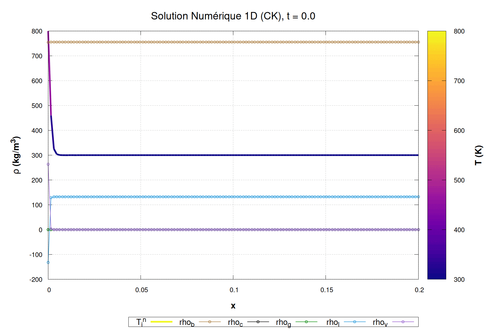

1D, EI, Temps d'exécution :  0.24829099999999998     
1D, CK, Temps d'exécution :  0.33322200000000002     
2D, EI, Temps d'exécution :   305.60074700000001
2D_2W, EI, Temps d'exécution :   299.80106799999999 

